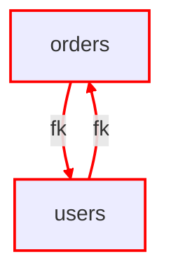

# sqldefkit

sqldefkit bundles a directory tree of `.sql` schema files into a single,
dependency-ordered `.sql` file for [sqldef](https://github.com/sqldef/sqldef)
(`psqldef` / `mysqldef` / `sqlite3def`).

sqldef itself takes one schema file describing the desired end state of a
database. As a schema grows, keeping it in one file becomes unwieldy, but
splitting it into multiple files (one per table, say) reintroduces a
problem: file order has to respect foreign keys, views, indexes, and
triggers, and that gets harder to maintain by hand as the schema evolves.
sqldefkit lets you split freely — file names and directory layout can
reflect whatever organization makes sense to you — and computes a safe
statement order automatically before concatenating everything into one
file.

## Install

```sh
go install github.com/Lazialize/sqldefkit/cmd/sqldefkit@latest
```

Or download a prebuilt binary from the
[releases page](https://github.com/Lazialize/sqldefkit/releases).

## Usage

```
sqldefkit bundle [--config <path>] [--dir <path>] [--dialect <postgres|mysql|sqlite>] [-o <file>]
sqldefkit check [--config <path>] [--dir <path>] [--dialect <postgres|mysql|sqlite>]
sqldefkit graph [--config <path>] [--dir <path>] [--dialect <postgres|mysql|sqlite>] [--format dot|mermaid|json] [-o <file>]
sqldefkit lsp
sqldefkit version
```

`bundle` is the main command:

- `--config` — path to a `sqldefkit.yaml`/`sqldefkit.yml` config file. If omitted, sqldefkit discovers one by walking up from the current directory (see below). Not finding one is fine as long as `--dir`/`--dialect` are supplied via flags.
- `--dir` — root directory to scan recursively for `*.sql` files. Directories whose name starts with `.` are skipped.
- `--dialect` — one of `postgres`, `mysql`, `sqlite`.
- `-o` — output file path (default: stdout).

For each of `--dir`, `--dialect`, and `-o`, precedence is: explicit flag > value from the config file > built-in default (`--dir` defaults to `.`, `-o` defaults to stdout). `--dialect` has no built-in default — it must come from a flag or the config file, or `bundle` fails with an error naming both options.

`check` validates a schema tree and reports diagnostics without bundling anything; see [Checking a schema tree](#checking-a-schema-tree) below. It accepts the same `--config`/`--dir`/`--dialect` flags (with the same resolution precedence) as `bundle`.

`graph` emits the schema's dependency graph as DOT, Mermaid, or JSON; see [Visualizing the dependency graph](#visualizing-the-dependency-graph) below. It accepts the same `--config`/`--dir`/`--dialect` flags as `bundle`/`check`, plus `--format` (default `dot`) and `-o` (default: stdout; unlike `bundle`, this is not read from the config file's `out`).

`lsp` runs a Language Server Protocol server over stdio; see [Editor integration (LSP)](#editor-integration-lsp) below.

`sqldefkit version` prints the version and exits.

### Config file (`sqldefkit.yaml`)

A project can carry a `sqldefkit.yaml` (or `sqldefkit.yml` — having both in the same directory is an error) to make its dialect and schema layout self-describing instead of repeating flags on every invocation:

```yaml
dialect: postgres      # postgres | mysql | sqlite
schema_dir: schema     # path to schema root, relative to this file's directory (absolute also allowed)
out: bundled.sql       # default output path, relative to this file's directory; omit = stdout
```

All fields are optional, and unknown fields are rejected. `schema_dir` and `out`, when relative, are resolved against the directory containing the config file — not the current working directory — so `bundle` behaves the same regardless of where it's invoked from within the project.

`sqldefkit bundle` (with no `--config`) searches for the config file starting at the current directory and walking upward to the filesystem root, stopping at the first match. This also means the config file doubles as a project-root marker: a future sqldefkit LSP server will use the same discovery walk from an open `.sql` file to locate the project root and its dialect.

### Worked example

Given a schema split across files where the file names don't happen to
match dependency order:

```
schema/
├── orders.sql
└── users.sql
```

```sql
-- schema/orders.sql
CREATE TABLE orders (
    id serial PRIMARY KEY,
    user_id integer NOT NULL REFERENCES users(id)
);
```

```sql
-- schema/users.sql
CREATE TABLE users (
    id serial PRIMARY KEY,
    email text NOT NULL UNIQUE
);
```

`orders.sql` sorts before `users.sql` alphabetically, but `orders`
references `users`. Running:

```sh
sqldefkit bundle --dir schema --dialect postgres
```

produces `users` before `orders`, regardless of file order:

```sql
-- Code generated by sqldefkit; DO NOT EDIT.

-- source: users.sql
CREATE TABLE users (
    id serial PRIMARY KEY,
    email text NOT NULL UNIQUE
);

-- source: orders.sql
CREATE TABLE orders (
    id serial PRIMARY KEY,
    user_id integer NOT NULL REFERENCES users(id)
);
```

See `examples/postgres` for a larger example (tables, an index, and a
view using the require directive described below).

### Feeding the output to sqldef

sqldef's tools (`psqldef`, `mysqldef`, `sqlite3def`) read the desired
schema from standard input via shell redirection, so the bundled output
can be piped straight in:

```sh
sqldefkit bundle --dir schema --dialect postgres | psqldef -U user mydb --dry-run
sqldefkit bundle --dir schema --dialect postgres | psqldef -U user mydb --apply
```

Or write it out first and inspect/version it before applying:

```sh
sqldefkit bundle --dir schema --dialect postgres -o schema.sql
psqldef -U user mydb --dry-run < schema.sql
psqldef -U user mydb --apply < schema.sql
```

## Dependency detection

sqldefkit splits each file into top-level statements (dialect-aware:
handles `$$`-quoted bodies, backtick/bracket/double-quoted identifiers,
and comments) and inspects each one to find what it defines and what it
depends on. Ordering is then a stable topological sort (ties broken by
file path, then statement position, so output stays deterministic run to
run and follows source order wherever dependencies allow), with cycles
reported as an error showing the dependency path.

Edges are extracted as follows:

- **`CREATE TABLE`**: depends on tables named in `REFERENCES` clauses (foreign keys).
- **`ALTER TABLE`**: depends on the table it modifies, plus any `REFERENCES` targets within it.
- **`CREATE INDEX`** / **`CREATE TRIGGER`**: depends on the table named after `ON`.
- **`CREATE VIEW`** / **`CREATE MATERIALIZED VIEW`**: depends on tables/views named directly after a top-level `FROM` or `JOIN` (best-effort — see limitations).

### Dependency cycles (mutually-referencing tables)

Two tables that reference each other via foreign keys are legal SQL — the
usual pattern is to create both tables first, then add the constraints
afterward via `ALTER TABLE` — so sqldefkit automatically splits a
dependency cycle when it can be sure doing so is safe:

```sql
-- orders.sql
CREATE TABLE orders (
    id serial PRIMARY KEY,
    user_id integer NOT NULL REFERENCES users (id)
);
```

```sql
-- users.sql
CREATE TABLE users (
    id serial PRIMARY KEY,
    email text NOT NULL UNIQUE,
    favorite_order_id integer REFERENCES orders (id)
);
```

`orders` and `users` reference each other, forming a cycle. Instead of
failing, `bundle` extracts each foreign key that closes the cycle out of
its `CREATE TABLE` and emits it as a separate `ALTER TABLE ... ADD ...`
statement, sorted after both tables involved:

```sql
CREATE TABLE orders (
    id serial PRIMARY KEY,
    user_id integer NOT NULL
);

CREATE TABLE users (
    id serial PRIMARY KEY,
    email text NOT NULL UNIQUE,
    favorite_order_id integer
);

-- fk constraint moved by sqldefkit to break a dependency cycle (from orders.sql)
ALTER TABLE orders ADD FOREIGN KEY (user_id) REFERENCES users (id);

-- fk constraint moved by sqldefkit to break a dependency cycle (from users.sql)
ALTER TABLE users ADD FOREIGN KEY (favorite_order_id) REFERENCES orders (id);
```

This applies to both table-level (`[CONSTRAINT name] FOREIGN KEY (...)
REFERENCES ...`) and inline column-level (`col type REFERENCES ...`)
foreign keys, and to longer cycles (A → B → C → A) as well as two-table
ones. The extraction is conservative: it only rewrites what it can
identify from the token stream with certainty (never a regex-over-text
guess), so it can never corrupt a constraint it doesn't fully
understand.

For the **sqlite** dialect, FK cycles are recognized the same way but
the constraints are left inline and no `ALTER TABLE` is synthesized:
SQLite both lacks `ALTER TABLE ... ADD FOREIGN KEY` and permits forward
references (foreign keys resolve at DML time, so a `CREATE TABLE` may
legally reference a table that doesn't exist yet) — the tables are
simply emitted verbatim in deterministic order.

A cycle is still a hard error, exactly as before, when:

- **it isn't made entirely of foreign keys** — a cycle closed by a view's
  `FROM`/`JOIN`, a `require` directive, an `INDEX`/`TRIGGER`'s `ON`
  target, or an `ALTER TABLE` target can't be split (there's no
  equivalent "declare now, constrain later" move for those), so it
  reports the same `dependency cycle detected: ...` message as always.
- **a foreign key in the cycle can't be extracted with certainty** — an
  unrecognized construct around a `REFERENCES` clause falls back to the
  same cycle error, with one added sentence pointing at the fix: move the
  constraint to a table-level `CONSTRAINT ... FOREIGN KEY` clause or an
  explicit `ALTER TABLE`.

`sqldefkit check` and the LSP treat a breakable cycle as a complete
non-issue (no diagnostic at all, since `bundle` will handle it), and an
unbreakable one exactly as they always have.

**MySQL note:** an inline column-level `REFERENCES` (e.g. `user_id int
REFERENCES users(id)`) is accepted by MySQL's grammar but silently
ignored by InnoDB — it does not actually create a foreign key constraint.
sqldefkit extracts it the same way it does everywhere else, which means
the resulting `ALTER TABLE ... ADD FOREIGN KEY ...` in the bundled output
*does* create a real, enforced constraint under InnoDB. If that inline
form was being relied on as a no-op, splitting the cycle changes runtime
behavior, not just formatting.

### The `require` directive

Some dependencies aren't recognizable from the patterns above — most
notably a column typed as a `CREATE TYPE` enum, or a table only reached
through a subquery. Declare these explicitly with a leading comment
directive immediately above the statement:

```sql
-- sqldefkit:require users, other_schema.some_type
CREATE VIEW order_totals AS
SELECT (SELECT email FROM users WHERE ...), ...
FROM orders;
```

Names are normalized the same way automatically-detected names are (see
below); multiple names may be listed space- or comma-separated, and
directives may repeat.

## Checking a schema tree

`sqldefkit check` loads and parses a schema tree the same way `bundle`
does, but instead of emitting bundled SQL it reports diagnostics — one
line per issue, to stdout, sorted by file/line/column:

```
path/to/file.sql:line:col: error: message
path/to/file.sql:line:col: warning: message
```

Paths are printed relative to the schema root, with forward slashes
regardless of platform. If there's nothing to report, `check` prints
nothing.

Rules:

- **error** — a lex/parse failure; a duplicate definition of the same
  object name (reported at the later definition, naming the first
  definition's location); a dependency cycle that `bundle` can't split
  automatically (reported once, at the first participant in the cycle,
  showing the cycle path the same way `bundle` does — see [Dependency
  cycles](#dependency-cycles-mutually-referencing-tables) for which
  cycles those are). A cycle `bundle` *can* split automatically produces
  no diagnostic at all.
- **warning** — a high-confidence reference (a `REFERENCES` target, an
  `INDEX`/`TRIGGER` `ON` target, an `ALTER TABLE` target, or a name in a
  `require` directive) that isn't defined anywhere in the schema tree.
  Directive typos are a common source of these — a misspelled
  `-- sqldefkit:require` name warns just like a misspelled `REFERENCES`
  target. Best-effort view `FROM`/`JOIN` scanning is deliberately
  excluded from this check: aliases and subqueries make it too prone to
  false positives to be a useful warning.

Exit code is 1 if any error-severity diagnostic was found, 0 otherwise —
warnings alone don't fail the check.

Example, given a schema with an undefined foreign key target and a
duplicate table definition:

```sh
$ sqldefkit check --dir schema --dialect postgres
orders.sql:4:5: warning: unknown reference "ghost_table": not defined in this schema
users.sql:1:14: error: duplicate definition of "users": first defined at other.sql:1:14, redefined at users.sql:1:14
$ echo $?
1
```

## Visualizing the dependency graph

`sqldefkit graph` loads a schema tree the same way `bundle`/`check` do and
emits the dependency graph it computed, in one of three formats:

```sh
sqldefkit graph --dir schema --dialect postgres --format dot
sqldefkit graph --dir schema --dialect postgres --format mermaid
sqldefkit graph --dir schema --dialect postgres --format json
```

- `--format` — `dot` (default), `mermaid`, or `json`.
- `-o` — output file path (default: stdout).

Unlike `bundle`/`check`, `graph` never fails on a dependency cycle —
visualizing cycles is the point. Every node and edge that's part of a
cycle (computed the same way `bundle`'s FK-cycle-breaking pass finds one,
via strongly connected components) is flagged, regardless of whether
`bundle` would go on to split it automatically.

Given the mutually-referencing `orders`/`users` tables from
[Dependency cycles](#dependency-cycles-mutually-referencing-tables)
above, `--format mermaid` produces:



Nodes are labeled with the object's name (schema-qualified names are kept
as the label even though the underlying Mermaid node id is sanitized —
Mermaid ids can't contain `.`); both nodes and edges inside a cycle get a
red highlight via a `cycle` class/`linkStyle`.

`--format dot` produces an equivalent Graphviz digraph (node shape varies
by kind — boxes for tables, ellipses for views, and so on; edge style
varies by kind — solid for foreign keys, dashed for view/directive edges,
dotted for `ON` targets; cycle members are colored red):

```
digraph dependencies {
  rankdir=LR;
  "orders" [label="orders", shape=box, color="red"];
  "users" [label="users", shape=box, color="red"];
  "orders" -> "users" [label="fk", style=solid, color="red"];
  "users" -> "orders" [label="fk", style=solid, color="red"];
}
```

`--format json` produces the same versioned payload the
`sqldefkit/dependencyGraph` LSP request returns (see below): a `version`
field, an array of `nodes` (`id`, `kind`, `file`/`line`/`col` when
defined in the schema, `external`/`unknown` for a high-confidence
reference to a name that isn't, `inCycle`), and an array of `edges`
(`from`, `to`, `kind` — one of `fk`, `on`, `view`, `directive`, `alter`
— and `inCycle`). A best-effort view `FROM`/`JOIN` reference to an
undefined name is dropped entirely rather than turned into an external
node, matching `check`'s treatment of the same case (see
[Checking a schema tree](#checking-a-schema-tree)).

## Editor integration (LSP)

`sqldefkit lsp` runs a Language Server Protocol server over stdio. It provides:

- **Diagnostics** — the same errors and warnings `sqldefkit check` reports
  (parse errors, duplicate definitions, dependency cycles, unresolved
  high-confidence references), published live as you edit.
- **Go to definition** — jump from a table/view/etc. name (a reference or a
  definition) to where it's defined.
- **Hover** — hover a table/view/etc. name to see the statement that defines
  it and the file it's defined in.
- **Completion** — after `REFERENCES`, inside a `-- sqldefkit:require`
  directive comment, or after `ON` in `CREATE INDEX`/`CREATE TRIGGER`, complete
  defined object names.
- **Dependency graph** — a custom `sqldefkit/dependencyGraph` request (params:
  `{"uri": "file://..."}`, naming any file in the project) returns the same
  JSON payload `sqldefkit graph --format json` produces (see
  [Visualizing the dependency graph](#visualizing-the-dependency-graph)),
  computed overlay-aware from the project's current in-editor buffers. The
  server advertises this under `capabilities.experimental.dependencyGraph` in
  its `initialize` response so clients can feature-detect it; a file outside
  any project returns a `null` result, not an error, like every other
  position-based request here.

A project is recognized the same way `bundle`/`check` discover one: by
finding a `sqldefkit.yaml` (or
`.yml`) above the open file, with a `dialect` set and the file located under
its `schema_dir`. Files outside any such project get no diagnostics and no
go-to-definition results.

Any LSP-capable editor can use it by running `sqldefkit lsp` with the project
root marked by `sqldefkit.yaml`/`sqldefkit.yml`. Minimal Neovim setup:

```lua
vim.api.nvim_create_autocmd("FileType", {
  pattern = "sql",
  callback = function()
    vim.lsp.start({
      name = "sqldefkit",
      cmd = { "sqldefkit", "lsp" },
      root_dir = vim.fs.root(0, { "sqldefkit.yaml", "sqldefkit.yml" }),
    })
  end,
})
```

### VS Code

A minimal VS Code extension that starts `sqldefkit lsp` lives in
[`editors/vscode`](editors/vscode). It is not published to the marketplace;
build and install it locally:

```sh
cd editors/vscode
npm install
npm run build
npm run package
code --install-extension sqldefkit-vscode-0.2.0.vsix
```

It also adds an `sqldefkit: Show Dependency Graph` command that renders the
project's dependency graph in a WebView, with click-to-jump to definitions.

See [`editors/vscode/README.md`](editors/vscode/README.md) for settings and
details.

## Limitations

- **Enum/custom types are not auto-detected.** A column declared as
  `status my_enum_type` does not produce a dependency edge — use
  `-- sqldefkit:require my_enum_type`.
- **View/trigger body parsing is best-effort.** Only identifiers
  immediately following a top-level `FROM` or `JOIN` are picked up;
  subqueries used as expressions (e.g. in the `SELECT` list), CTEs, and
  dependencies expressed only inside function bodies are not descended
  into. Use the `require` directive for anything missed.
- **Identifier normalization is an approximation.** Unquoted identifiers
  are lower-cased and quoted identifiers keep their written case, which
  matches PostgreSQL's folding rules exactly but is only an approximation
  for MySQL/SQLite, whose real case-sensitivity depends on platform and
  collation settings. This affects how names are matched for dependency
  resolution, not the emitted SQL text (statement bodies are passed
  through verbatim).
- Statements that don't match any recognized `CREATE`/`ALTER` pattern are
  passed through in file order (relative to their own file) with no
  dependency edges except those from `REFERENCES` occurring anywhere in
  them and any `require` directive.

## License

MIT — see [LICENSE](LICENSE).
